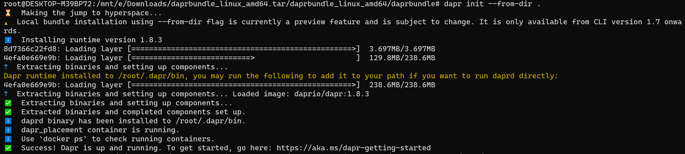

# Dapr 初始化

> 本文仅以Linux系统，self-hosted部署，dapr版本1.8.3为例

主要讲解了通过Dapr CLI实现的Dapr初始化：
* [Dapr在线初始化](#online)
* [Dapr离线初始化](#offline)

以及如何跳过Dapr CLI完全去自定义Dapr运行环境：
* [Dapr自定义初始化](#customize)

## 一、Dapr CLI和初始化简介

### 1. Dapr CLI简介

Dapr CLI 用于各种 Dapr 相关任务的命令行工具
* 可以用来来运行一个带有Dapr sidecar的应用程序
* 可以用来查看sidecar日志、列出运行中的服务、运行 Dapr 仪表板等
* The Dapr CLI works with both self-hosted and Kubernetes environments.

### 2. Dapr CLI安装
> 鉴于网络问题，我比较推崇二进制版本手动下载安装

* [官方文档](https://docs.dapr.io/zh-hans/getting-started/install-dapr-cli/)

### 3 Dapr初始化是什么？

> Dapr初始化可以理解为创造Dapr的运行环境

Dapr runs as a sidecar alongside your application. In self-hosted mode, this means it is a process on your local machine. By initializing Dapr, you:

* Fetch and install the Dapr sidecar binaries（that means daprd） locally.
* Create a development environment that streamlines application development with Dapr.

Dapr initialization includes:

* Running a Redis container instance to be used as a local state store and message broker.
* Running a Zipkin container instance for observability.
* Creating a default components folder with component definitions for the above.
* Running a Dapr placement service container instance for local actor support.

## 二、<a id="online">Dapr在线初始化</a>

**这是官方，以及大部分博客或公众号提及的方式**

### 1. 学习链接

* [Init Dapr Locally](https://docs.dapr.io/getting-started/install-dapr-selfhost/)

### 2. 初始化命令
```csharp
// 默认在线初始化方式
dapr init

// 或者在线精简版初始化，目前测试下来等同于离线初始化
dapr init --slim
```

### 3. 初始化结果(非精简版)
> Dapr在线初始化的黑盒操作赋予了你什么能力以及为你做了哪些事情
* 核心sidecar：daprd
* dapr_placement容器：供Actor构建块使用
* dapr_redis容器：供State management构建块和PubSub构建块使用
* dapr_zipkin容器：供Observablity构建块使用

## 三、<a id="online">Dapr离线初始化</a>

**Dapr Install Bundle各版本可能存在差异，详情请参阅Release Note**

**目前测试下来，等同于在线初始化的 dapr init --slim 的操作**

### 1. 学习链接
* [Dapr Install Bundle](https://github.com/dapr/installer-bundle)

### 2. 初始化命令
```csharp
dapr init --from-dir {dapr bundle路径}
```
> Dapr Install Bundle各版本不同，其初始化表现不一定一致
> 
> 1.7.0的版本则包含了daprd，容器：placement，zipkin，redis
> 
> 1.8.3的版本则只包含了daprd，容器：placement

### 3. 初始化输出


### 4. 初始化结果
> Dapr离线初始化的黑盒操作赋予了你什么能力以及为你做了哪些事情
* 核心sidecar：daprd（注意上面离线初始化控制台输出截图中黄色的那行字预示着你可以单独运行它！不用再依赖于Dapr CLI工具去启动Dapr Sidecar）
* dapr_placement容器：供Actor构建块使用

## 四、验证dapr init的正确性
* docker ps 验证容器（具体应该有哪些容器，按照你初始化的方式而定）是否生成
* 验证目录：自行观察~/.dapr路径下的产物和资源，这些都是初始化的结果

## 五、<a id="customize">Dapr自定义初始化</a>

### 1. Dapr CLI的封装局限性

>微软总是想给你啥都封装好，给你做好前提的所有工作，让你专注于业务的实现；

> 但是就这学习的原则，我们必须深入去了解其中的原理，摒弃Dapr CLI给我们带来的便利性

所以你可能会有多个角度不想使用Dapr CLI去做初始化：
* 完全的黑盒，无法知道这个命令做了什么
* 为了学习，想尽可能全面的了解初始化过程中做了什么
* 想在初始化过程中自定义一些事情

### 2. 自定义初始化

> 首先弄清楚Dapr init初始化实际上做了什么，在第一点就提到了，Dapr初始化：
> 
> 1. 获取 Dapr sidecar 二进制文件（也就是daprd）并将其安装到本地；
> 
> 2. 创建了三个docker容器以及默认组件文件夹等

搞清楚做了什么，那我们就可以清楚的了解其中的每个步骤以及自己如何去自定义：

### 3. Daprd的获取
* Dapr Sidecar二进制文件：你可以从github拉取[dapr](https://github.com/dapr/dapr)项目，自行编译daprd（当然你想添加新的功能后再编译也是可以的）
* Dapr Sidecar二进制文件：你可以从github拉取[dapr bundle](https://github.com/dapr/installer-bundle)项目的Release包，解压开来里面就有你需要的daprd

### 4. 容器的生成

默认的dapr init会生成三个镜像，当然你后期为了接入更多的Building Blocks构建块，可能会需要更多的服务镜像来支持dapr组件，这个暂且按下不表

参照官方docker ps的结果很容易得出默认的三个容器所对应的镜像：

** 特别注意，不同版本可能用的镜像及其版本有所区别 **
* openzipkin/zipkin
* redis                            // 暂且不论：redislabs/rejson
* daprio/dapr:1.8.3

> 可以看下这个组织[daprio](https://hub.docker.com/u/daprio)，里面将一些常见的dapr服务都打成了镜像，你可以很方面的获取并运行

默认的三个镜像运行生成容器：
```
docker run --name "dapr_zipkin" --restart always -d -p 9411:9411 openzipkin/zipkin

// 其他镜像：redislabs/rejson
docker run --name "dapr_redis" --restart always -d -p 6379:6379 redis

// 注意这边规定了daprio/dapr的版本；如果不同版本，则可能会存在部分端口映射的区别
docker run --name "dapr_placement" --restart always -d -p 50005:50005 daprio/dapr:1.8.3
```
